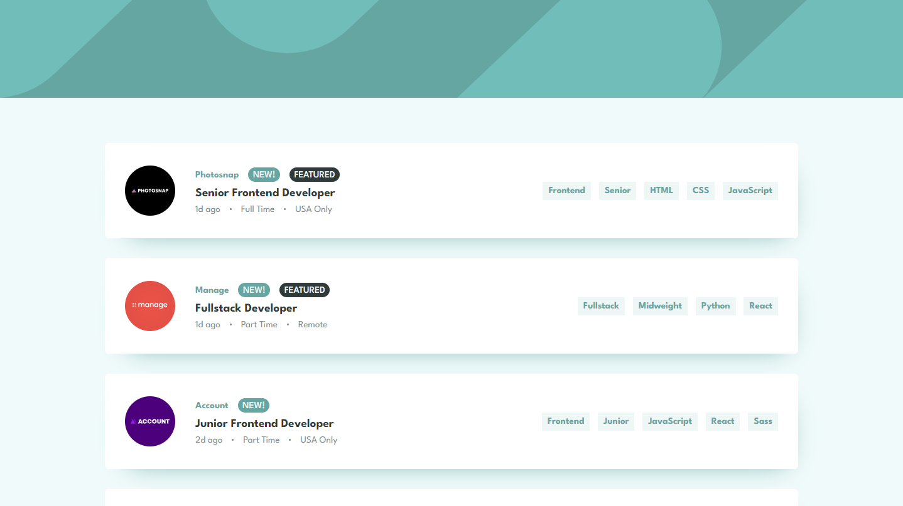
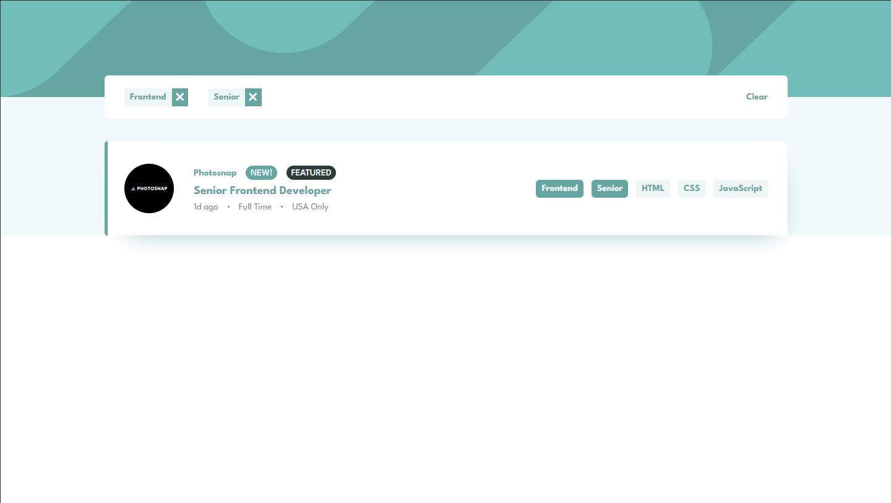
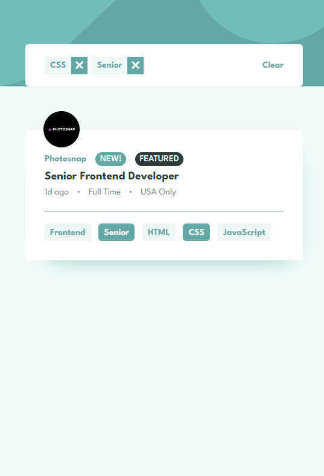

# Frontend Mentor - Job listings with filtering solution

This is a solution to the [Job listings with filtering challenge on Frontend Mentor](https://www.frontendmentor.io/challenges/job-listings-with-filtering-ivstIPCt). Frontend Mentor challenges help you improve your coding skills by building realistic projects.

## Table of contents

-   [Overview](#overview)
    -   [The challenge](#the-challenge)
    -   [Screenshot](#screenshot)
    -   [Links](#links)
-   [My process](#my-process)
    -   [Built with](#built-with)
    -   [What I learned](#what-i-learned)
    -   [Continued development](#continued-development)
    -   [Useful resources](#useful-resources)
-   [Author](#author)

## Overview

### The challenge

Users should be able to:

-   View the optimal layout for the site depending on their device's screen size
-   See hover states for all interactive elements on the page
-   Filter job listings based on the categories
-   As bonus I added toggling tags from cards along with showing the ones filtered

### Screenshot

### Links

-   Solution URL: [Front-end mentor solution](https://www.frontendmentor.io/solutions/responsive-job-listing-with-react-and-css-TXbnCvE1TS)
-   Live Site URL: [https://job-listing-fm.web.app/](https://job-listing-fm.web.app/)

## My process

### Built with

-   Semantic HTML5 markup
-   CSS custom properties
-   Flexbox
-   CSS Grid
-   [React](https://reactjs.org/) - JS library

### What I learned

-   big challenge was to add border left to job card on hovering position , I am proud of that

### Continued development

-   responsive designs

### Useful resources

-   Stackoverflow
-   MDN

## Author

-   Website - [Aryan Sethi](https://github.com/Aryan-ki-codepanti)
-   Frontend Mentor - [@Aryan Sethi](https://www.frontendmentor.io/profile/Aryan-ki-codepanti)
